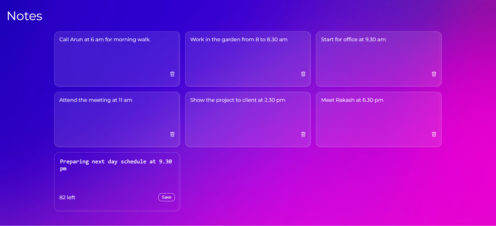

<h1 align="center">Notes App with React and LocalStorage</h1>

## Demo
https://note-app-apurbar06.vercel.app/
<p align="center">
  
</p>


## About
This is a simple web application built with React that allows users to create and save notes to LocalStorage.


## Features
- Create new notes with content
- Delete existing notes
- Persist notes to LocalStorage, so they are saved even when the browser is closed


## Getting started
To get started with the app, you can follow these steps:
``` bash
# Clone this project
$ git clone https://github.com/apurbar06/React_things
# Access
$ cd note_app
# Install the necessary dependencies
$ npm install
# Start the development server
$ npm start
```
The app should now be running on http://localhost:3000.


## License
This app is released under the MIT License.
