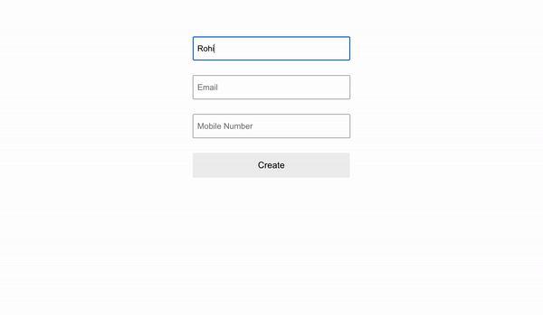

<h1 align="center">Submit Form Data To REST API</h1>


## Demo
https://submit-form-data-rest-api.vercel.app/
<p align="center">
  
</p>


## About
The form accepts some input fields and submitting it will post these data to an external REST API.


## Getting started
To get started with the app, you can follow these steps:
``` bash
# Clone this project
$ git clone https://github.com/apurbar06/React_things
# Access
$ cd submit-form-data-rest-api
# Install the necessary dependencies
$ npm install
# Start the development server
$ npm start
```
The app should now be running on http://localhost:3000.


## License
This app is released under the MIT License.
